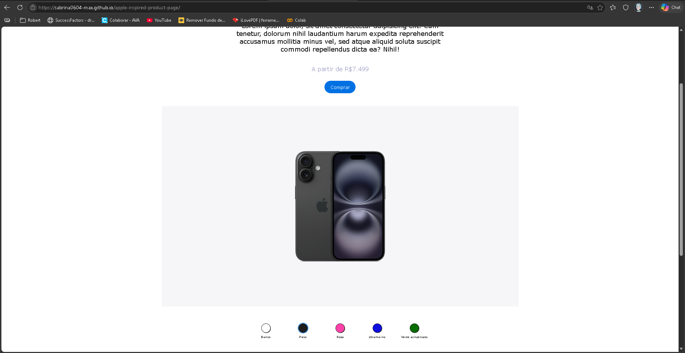

# 🍎 Apple Inspired Product Page

Projeto inspirado na página de produto da Apple, desenvolvido com HTML, CSS e JavaScript.

## 📸 Preview



---

## 🚀 Tecnologias utilizadas

- HTML5
- CSS3
- JavaScript

---

## 🎯 Funcionalidades

- Layout inspirado no site da Apple
- Menu de navegação superior
- Seleção de cores do produto
- Troca dinâmica de imagem com JavaScript
- Animação de transição ao trocar a cor
- Design responsivo básico

---

## 📂 Estrutura do projeto

```bash
📁 apple-inspired-product-page
 ├── 📁 img
 ├── index.html
 ├── style.css
 ├── script.js
```

---

## ▶️ Como executar o projeto

1. Clone o repositório:

```bash
git clone https://github.com/sabrina0604-max/apple-inspired-product-page.git
```

2. Abra o arquivo `index.html` no navegador.

---

## 💻 Demonstração

Você pode acessar o projeto online aqui:

[Acessar projeto](https://sabrina0604-max.github.io/apple-inspired-product-page/)

---

## 📌 Aprendizados

- Manipulação do DOM com JavaScript
- Eventos de clique
- Alteração dinâmica de imagens
- Organização de layout com CSS
- Criação de interface inspirada em UI real

---

## 👩‍💻 Autora

Feito por [Sabrina Rodrigues Medeiros](https://github.com/sabrina0604-max)
